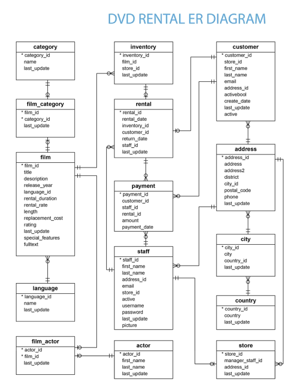

# SQL Handbook

Własna baza wiedzy z SQL tworzona podczas nauki.

Nie są to notatki z jednego kursu, lecz uporządkowany zbiór wiedzy z różnych źródeł.

---

# Cele projektu

- uporządkowanie wiedzy
- własny podręcznik SQL
- przygotowanie do pracy Data Analyst
- przygotowanie do ekonometrii
- baza do przyszłych projektów
  
---

# Środowisko
- PostgreSQL
- baza DVD Rental
- baza leaders 
- Visual Studio Code
- SQLTools

---

## Bazy danych 

## DVD Rental

Źródło: 
- Neon, PostgreSQL Tutorial: https://neon.com/postgresql/getting-started/sample-database

## Leaders

Źródło: 
- DataCamp, Joining Data in SQL: https://app.datacamp.com/learn/courses/joining-data-in-sql
  
---

# Źródła

## Kursy

- [x] DataCamp - Introduction to SQL
- [x] DataCamp - Intermediate SQL
- [ ] DataCamp - Joining Data in SQL
- [ ] DataCamp - Data Manipulation in SQL
- [ ] DataCamp - PostgreSQL Summary Stats and Window Functions
- [ ] DataCamp - Functions for Manipulating Data in PostgreSQL
- [ ] DataCamp - Database Design

## Książki

## Dokumentacja

- PostgreSQL Documentation 

---

# Spis treści 

## 1. SELECT
## 2. AS (alias)
## 3. DISTINCT
## 4. CREATE VIEW
## 5. LIMIT
## 6. COUNT()
### 6.1. COUNT(DISTINCT)
### 6.2. COUNT() multiple columns
## 7. Kolejność wykonywania poleceń
## 8. Podręcznik stylu SQL
## 9. WHERE - filtrowanie z liczbami
### 9.1. WHERE - filtrowanie z tekstem
### 9.2. WHERE - operatory
### 9.3. WHERE i LIMIT
## 10. OR, AND, BETWEEN
### 10.1. OR
### 10.2. AND
### 10.3. BETWEEN
### 10.4. AND, OR
### 10.5. BETWEEN, AND, AND
## 11. LIKE, NOT LIKE, OR, IN, %, _
### 11.1. Najczęściej używane wzorce % i _
### 11.2. LIKE z operatorem % i _
### 11.3. NOT LIKE z operatorem % i _
### 11.4. OR
### 11.5. IN (OR vs IN)
## 12. Braki danych
### 12.1. IS NULL
### 12.2. IS NOT NULL
### 12.3. COUNT() vs IS NOT NULL
## 13. AVG(), SUM(), MIN(), MAX(), COUNT()
### 13.1. AVG()
### 13.2. SUM()
### 13.3. MIN()
### 13.4. MAX()
### 13.5. MIN(), MAX() z wartościami nienumerycznymi 
### 13.6. COUNT() w podsumowaniu danych
## 14. ROUND()
## 15. Arytmetyka
## 16. ORDER BY - sortowanie rezultatów
### 16.1. ORDER BY, ASC, DESC - sortowanie rosnąco i malejąco
### 16.2. ORDER BY - sortowanie po wielu zmiennych
### 16.3. ORDER BY - sortowanie po wielu zmiennych z WHERE
## 17. GROUP BY - grupowanie danych
### 17.1. GROUP BY i ORDER BY - grupowanie wielu zmiennych 
## 18. HAVING - filtrowanie pogrupowanych danych
---

# Pliki

| Plik | Opis |
|------|------|
| sql-handbook.sql | Kod tworzony podczas kursów |
| dvdrental-er-diagram.png | dvdrental Entity-Relational Diagram |
| sql-for-data-science.pdf | SQL Basics Cheat Sheet (DataCamp) |
| aggregate-functions-vs-arithmetic.png | Różnica między funkcjami agregującymi i operacjami arytmetycznymi |